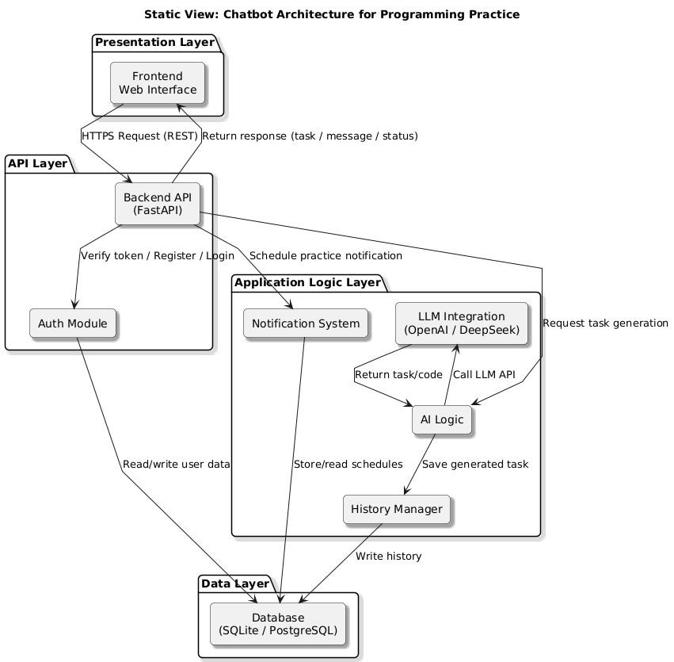

# Static View – Layered and Modular Architecture

## System Layers

### 1. Presentation Layer (Frontend)
- The web interface for user interaction with the chatbot.
- Sends requests to the API and displays responses and coding practice tasks.

### 2. API Layer (Backend)
- Handles requests from the frontend.
- Performs user authentication, request routing, and coordinates communication with internal modules.

### 3. Application Logic Layer
- Integrates with the OpenAI API or DeepSeek.
- Responsible for task generation, notification scheduling, and chat history management.

### 4. Data Layer (Database)
- Stores users, message history, notification schedules, logs, and other persistent data.

## Components

- Frontend (HTML/CSS/JavaScript)
- Backend (FastAPI)
- Auth Module
- Notification System
- LLM Integration Module
- AI Logic
- History Manager
- Database (SQLite or PostgreSQL)
- CI/CD and Deployment (e.g., GitHub Actions, Render)

## Diagram

